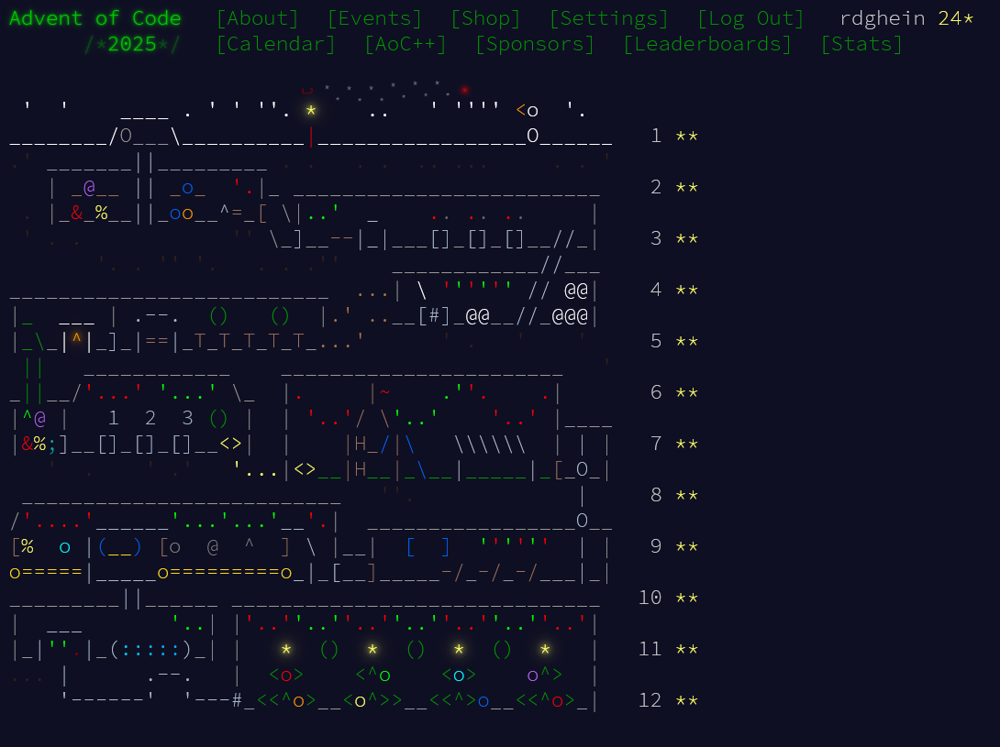

# AdventOfCode 2025

All 12 days in Rust.

Mostly native Rust without libraries, only using Itertools.
All solutions are in single file for my convenience.
Not a lot of safety code and checks, for this I rather panic so I know something is really off.

